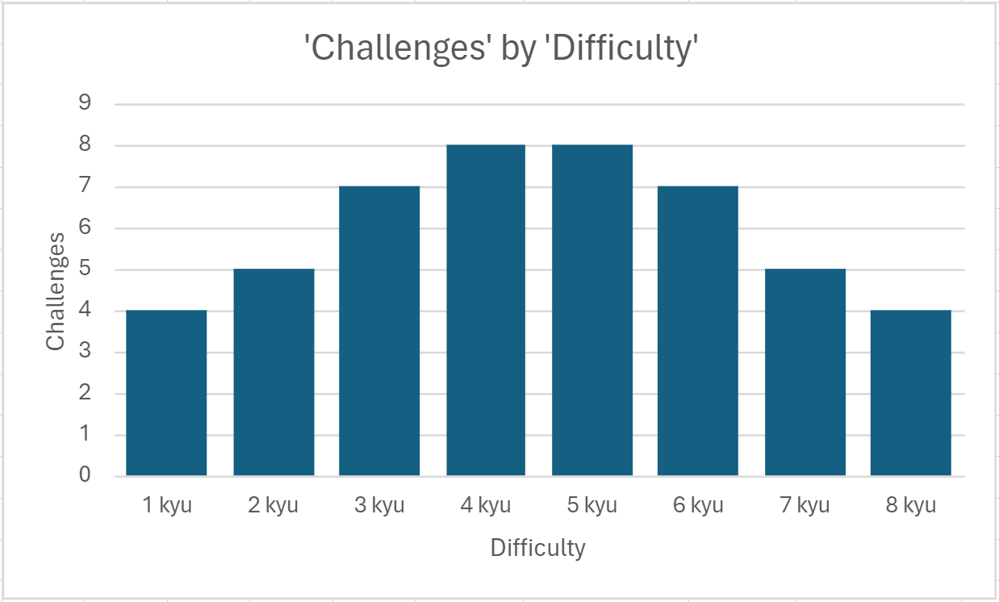

***
# Coding Challenges

 
|                                                                                       | Tags                                     | Points  |
| ------------------------------------------------------------------------------------- | ---------------------------------------- |---------|
| [7×7 Skyscrapers](https://www.codewars.com/kata/5917a2205ffc30ec3a0000a8) | Puzzles, Algorithms | 40
| [Tiny Three-Pass Compiler](https://www.codewars.com/kata/5265b0885fda8eac5900093b) |Compilers, Algorithms | 40
| [Loopover](https://www.codewars.com/kata/5c1d796370fee68b1e000611) |Puzzles,Algorithms,Game Solvers | 40
| [Puzzle Fighter](https://www.codewars.com/kata/5a3cbf29ee1aae06160000c9) |Games,Logic,Game Solvers,Algorithms| 40
| [6 By 6 Skyscrapers](https://www.codewars.com/kata/6-by-6-skyscrapers) |Mathematics,Puzzles,Games,Arrays,Matrix,Algorithms | 35
| [Full Metal Chemist #1: build me...](https://www.codewars.com/kata/5a27ca7ab6cfd70f9300007a) |Object-oriented Programming,Fundamentals | 35
| [Transforming Maze Solver](https://www.codewars.com/kata/5b86a6d7a4dcc13cd900000b) |Algorithms,Arrays,Performance,Puzzles | 35
| [Game of Go](https://www.codewars.com/kata/59de9f8ff703c4891900005c) |Games,Performance,Algorithms | 35
| [Insane Coloured Triangles](https://www.codewars.com/kata/5a331ea7ee1aae8f24000175) |Puzzles,Performance,Mathematics | 35
| [The Millionth Fibonacci Kata](https://www.codewars.com/kata/53d40c1e2f13e331fc000c26) |Mathematics,Algorithms  | 35
| [Screen Locking Patterns](https://www.codewars.com/kata/585894545a8a07255e0002f1) |Mathematics,Combinatorics,Geometry,Algorithms,Graph Theory | 35
| [Alphabetic Anagrams](https://www.codewars.com/kata/53e57dada0cb0400ba000688) |Mathematics,Logic,Strings,Algorithms | 35
| [Battleship field validator](https://www.codewars.com/kata/52bb6539a4cf1b12d90005b7) |Games, Arrays, Algorithms | 35
| [Simplifying](https://www.codewars.com/kata/57f2b753e3b78621da0020e8) |Games, Puzzles | 35
| [Blobservation](https://www.codewars.com/kata/5abab55b20746bc32e000008) |Logic, Games, Object-oriented Programming, Performance, Algorithms | 35
| [Papers,  Please](https://www.codewars.com/kata/59d582cafbdd0b7ef90000a0) |Object-oriented Programming, Games, Regular Expressions, Fundamentals | 35
| [Roman Numerals Helper](https://www.codewars.com/kata/51b66044bce5799a7f000003) |Algorithms, Object-oriented Programming | 30
| [How many numbers III?](https://www.codewars.com/kata/5877e7d568909e5ff90017e6) |Fundamentals, Data Structures, Algorithms, Mathematics, Logic | 30
| [4 By 4 Skyscrapers](https://www.codewars.com/kata/5671d975d81d6c1c87000022) |Puzzles, Algorithms | 30
| [Conway's Game of Life  - Unlimited Edition](https://www.codewars.com/kata/52423db9add6f6fc39000354) |Games, Arrays, Puzzles, Cellular Automata | 30
| [Next bigger number with the same digits](https://www.codewars.com/kata/55983863da40caa2c900004e) |Strings, Refactoring | 30
| [Snail](https://www.codewars.com/kata/521c2db8ddc89b9b7a0000c1) |Arrays, Algorithms | 30
| [Mahjong - #1 Pure Hand](https://www.codewars.com/kata/56ad7a4978b5162445000056) |Games, Logic, Algorithms | 30
| [The observed PIN](https://www.codewars.com/kata/5263c6999e0f40dee200059d) |Algorithms | 30
| [Pete,  the baker](https://www.codewars.com/kata/525c65e51bf619685c000059) |Algorithms | 25
| [Is the King in check ?](https://www.codewars.com/kata/5e28ae347036fa001a504bbe) |Games, Arrays, Strings, Algorithms | 25
| [Let's Play Darts!](https://www.codewars.com/kata/5870db16056584eab0000006) |Games, Algorithms | 25
| [Four Letter Words ~ Mutations](https://www.codewars.com/kata/5cb5eb1f03c3ff4778402099) |Strings, Arrays, Games, Parsing, Algorithms | 25
| [Snakes and Ladders](https://www.codewars.com/kata/587136ba2eefcb92a9000027) |Design Patterns, Games, Fundamentals | 25
| [Card-Chameleon,  a Cipher with Playing Cards](https://www.codewars.com/kata/59c2ff946bddd2a2fd00009e) |Cryptography, Games, Algorithms | 25
| [Optimized Pathfinding Algorithm](https://www.codewars.com/kata/57b4d2dad2a31c75f7000223) |Games, Algorithms, Puzzles | 25
| [Directions Reduction](https://www.codewars.com/kata/550f22f4d758534c1100025a) |Fundamentals | 25
| [Chaser's schedule](https://www.codewars.com/kata/628df6b29070907ecb3c2d83) |Logic, Algorithms | 16
| [Encrypt this!](https://www.codewars.com/kata/5848565e273af816fb000449) |Fundamentals, Strings, Regular Expressions, Arrays, Ciphers, Algorithms, Cryptography, Security | 16
| [Detect Pangram](https://www.codewars.com/kata/545cedaa9943f7fe7b000048) |Strings, Data Structures, Fundamentals | 16
| [The Deaf Rats of Hamelin](https://www.codewars.com/kata/598106cb34e205e074000031) |Fundamentals, Strings, Algorithms, Queues, Data Structures | 16
| [Take a Ten Minutes Walk](https://www.codewars.com/kata/54da539698b8a2ad76000228) |Arrays, Fundamentals | 16
| [Maze Runner](https://www.codewars.com/kata/58663693b359c4a6560001d6) |Arrays, Fundamentals | 16
| [Sudoku board validator](https://www.codewars.com/kata/63d1bac72de941033dbf87ae) |Algorithms, Games | 16
| [Complementary DNA](https://www.codewars.com/kata/554e4a2f232cdd87d9000038) |Strings, Fundamentals | 8
| [Descending Order](https://www.codewars.com/kata/5467e4d82edf8bbf40000155/) |Fundamentals | 8
| [Leap Years](https://www.codewars.com/kata/526c7363236867513f0005ca/) |Date Time, Algorithms | 8
| [Will you survive the zombie onslaught?](https://www.codewars.com/kata/5deeb1cc0d5bc9000f70aa74) |Games, Fundamentals | 8
| [Valid Parentheses](https://www.codewars.com/kata/6411b91a5e71b915d237332d) |Strings, Parsing, Algorithms | 8
| [All Star Code Challenge #18](https://www.codewars.com/kata/5865918c6b569962950002a1) |Fundamentals, Strings | 4
| [Sentence Smash](https://www.codewars.com/kata/53dc23c68a0c93699800041d) |Strings, Arrays, Fundamentals | 4
| [Multiply the number](https://www.codewars.com/kata/5708f682c69b48047b000e07) |Fundamentals | 4
| [Keep Hydrated!](https://www.codewars.com/kata/582cb0224e56e068d800003c) |Algorithms, Mathematics, Fundamentals | 4

***

***
