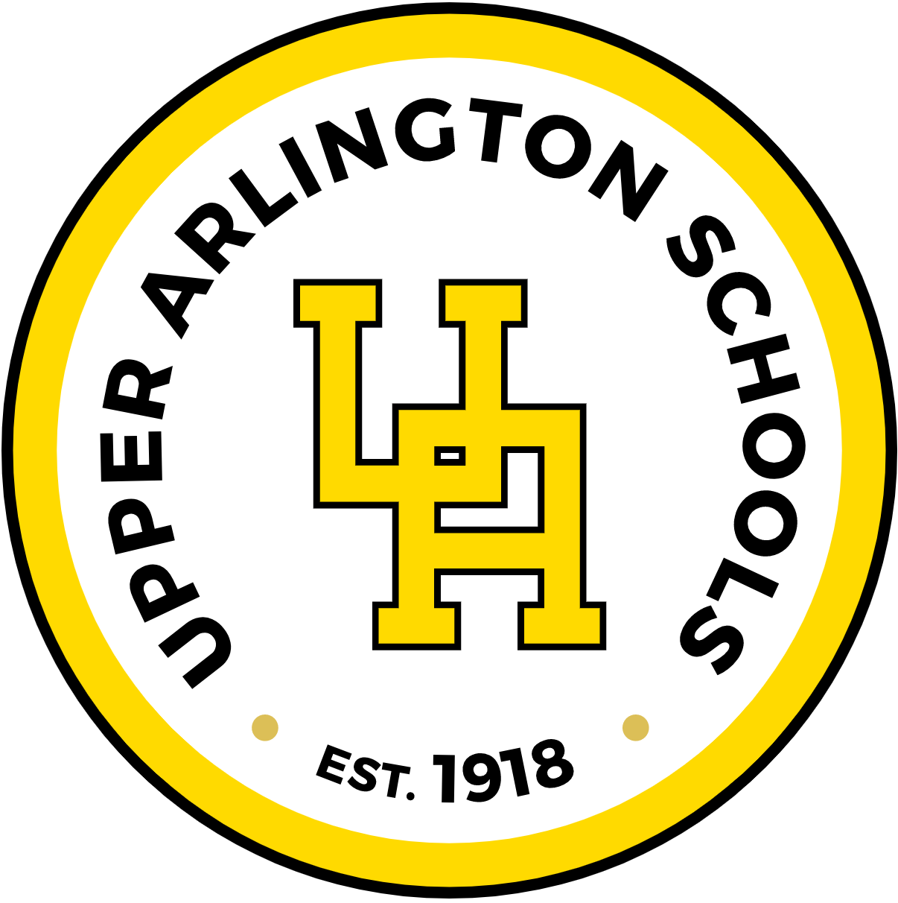

# Lab Guide — Detailed Walkthrough

This guide expands on the Lab Instructions in [README.md](./README.md). Each step includes:
- The original instruction (preserved)
- **Why it matters** — the underlying concept and reason behind the step
- **Hint** — a code pattern showing the shape of the solution (not the exact answer)

Work through the steps in order. After each change, refresh the browser to see your update.

---

## Club Home Page

### Step 1 — Decide on a new school club to found
Pick something fun, useful, or unique to your community. The README links to a list of [club ideas](https://getschooled.com/article/4082-35-unique-high-school-club-ideas-extracurricular-activities/) if you need inspiration.

> **Why it matters:** Your club concept drives every other choice on the page — the title, the heading, the quote, the images, even the colors you might want to use later. Pick something you actually care about; it makes the rest of the lab easier and more fun.

---

### Step 2 — Add `lang="en"` to `<html>`
> **Why it matters:** The `lang` attribute tells browsers, search engines, and assistive technologies what language the page is written in. Screen readers use it to choose the correct voice and pronunciation rules — without it, an English page might be read with French phonetics. It also helps Google index the page correctly.

**Hint:**
```html
<html lang="en">
```
The value follows [BCP 47](https://www.w3.org/International/articles/language-tags/) language codes (e.g., `"en"`, `"es"`, `"en-US"`).

---

### Step 3 — Add a unique `<title>` that explains the purpose of the page
> **Why it matters:** The `<title>` shows up in the browser tab, in bookmarks, and as the clickable headline in search results. Screen readers announce it first when a page loads, so it doubles as the page's "name." Generic titles like `"Home"` are unhelpful — be specific.

**Hint:**
```html
<title>Robotics Club - Upper Arlington High School</title>
```

---

### Step 4 — Add your club name to the `<h1 id="club-name">` header
> **Why it matters:** `<h1>` is the most important heading on a page and should describe the page's main topic. Screen reader users often jump between headings to navigate, and search engines weight `<h1>` text heavily. Best practice: exactly **one** `<h1>` per page, with subsections using `<h2>`, `<h3>`, etc., in order.

**Hint:** Find this line in `club.html` and put your club name between the tags:
```html
<h1 id="club-name">Your Club Name Here</h1>
```

---

### Step 5 — Add a favicon to the `<link rel="icon" href="">` tag
> **Why it matters:** A favicon ("favorite icon") is the small image that appears in the browser tab next to the page title, in bookmarks, and on the home screen when a user pins your site. It's a tiny touch that makes a site feel polished and helps users find your tab when they have many open.

**Hint:**
```html
<link rel="icon" href="./assets/img/favicons/favicon.ico">
```
This project already includes favicon files in `assets/img/favicons/`. Common formats: `.ico`, `.png`, `.svg`.

---

### Step 6 — Add a club quote or mission statement to the `<blockquote>` tag
> **Why it matters:** `<blockquote>` is a semantic element — it tells the browser and screen readers, "this is a quoted or featured passage." Screen readers may announce it as a quote, giving users context. Using a `<div>` instead would lose that meaning entirely.

**Hint:**
```html
<blockquote>
  "Building robots, building friendships."
  <footer>— Robotics Club Mission</footer>
</blockquote>
```

---

### Step 7 — Add four thumbnail images to the page with appropriate captions
> **Why it matters:** Images make a page engaging, but every `` **must** have an `alt` attribute. Screen readers read `alt` text aloud, and browsers display it when an image fails to load.  Decorative images can use `alt=""` to be skipped by screen readers.

**Hint:**
```html
<div class="card mb-4 box-shadow">
  
  <div class="card-body">
    <p class="card-text">Build night, October 2024</p>
  </div>
</div>
```

---

### Step 8 — Use Bootstrap to align three images in `<div id="image-section">` horizontally at viewports ≥768px
> **Why it matters:** Bootstrap's grid system divides each row into 12 invisible columns. Classes like `col-md-4` mean "take 4 of 12 columns starting at the medium breakpoint (≥768px)." Below 768px, the columns automatically stack vertically — that's responsive design in action. Three columns of `col-md-4` add up to 12, filling the row horizontally on tablets and larger screens.

**Hint:**
```html
<div class="row">
  <div class="col-md-4">First image card</div>
  <div class="col-md-4">Second image card</div>
  <div class="col-md-4">Third image card</div>
</div>
```
Bootstrap breakpoints (memorize these): `sm` ≥576px, `md` ≥768px, `lg` ≥992px, `xl` ≥1200px.

---

### Step 9 — Add an `href` attribute to the Registration nav link
> **Why it matters:** An `<a>` tag without an `href` is not a real link — it can't be clicked, can't be reached by keyboard `Tab`, and screen readers won't announce it as a link. The `href` value can be a full URL, a relative path (same folder), or a fragment (`#section-id`).

**Hint:**
```html
<li><a href="registration.html">Registration</a></li>
```
Use a relative path because both files live in the same folder.

---

### Step 10 — Run the axe plug-in and fix any issues
> **Why it matters:** [axe DevTools](https://www.deque.com/axe/devtools/) is a free browser extension that automatically scans your page against WCAG (Web Content Accessibility Guidelines) — the international standard for web accessibility. It catches things humans miss: low color contrast, missing labels, missing alt text, broken heading order, and more.

**Hint:**
1. Install "axe DevTools" from the Chrome Web Store.
2. Open Chrome DevTools (`F12` or right-click → Inspect).
3. Click the **axe DevTools** tab.
4. Click **Scan ALL of my page**.
5. Read each issue, click "Highlight" to find it on the page, and fix it in your HTML/CSS.

---

### Step 11 — Turn on NVDA and use the down arrow to navigate the page
> **Why it matters:** Automated tools like axe catch about 30% of accessibility issues. The other 70% require a human using a real screen reader. NVDA (NonVisual Desktop Access) is a free, open-source screen reader for Windows used by millions of blind and low-vision people daily.

**Hint:**
1. Download NVDA from [nvaccess.org](https://www.nvaccess.org/) and install it.
2. Start NVDA — you'll hear it announce "NVDA started."
3. Click on your page and press `Down Arrow` to read the next line, or `H` to jump heading-by-heading.
4. Listen carefully: Does every image describe what it shows? Are headings in a logical order? Does the page make sense without seeing it?
5. Press `Insert + Q` to quit NVDA when done.

---

### Step 12 — Review the website at three viewports: desktop, laptop, and mobile
> **Why it matters:** More than half of all web traffic comes from phones. A site that looks great on a 27" monitor can be unusable on a phone if it isn't responsive. Chrome DevTools lets you preview your page at any screen size without owning the device.

**Hint:**
1. Open DevTools (`F12`).
2. Click the device toolbar icon (top-left of DevTools, looks like a phone/tablet) or press `Ctrl+Shift+M`.
3. Use the dropdown to choose a preset (iPhone, iPad, Galaxy) or enter a custom width.
4. Common test widths: **Desktop** ~1440px, **Laptop** ~1024px, **Mobile** ~375px.
5. Watch for: text overflow, overlapping elements, navigation that becomes unusable, images that don't shrink.

---

## Registration Page

### Step 13 — Open the Registration page
Open `registration.html` in your editor and your browser side-by-side. You'll be making and previewing changes here for the rest of the lab.

---

### Step 2 (repeat) — Add `lang="en"` to `<html>`
Same concept as the Club Home Page — see [Step 2](#step-2--add-langen-to-html) above. Every page in your site needs its own `lang` attribute.

---

### Step 3 (repeat) — Add a unique `<title>`
Same concept — see [Step 3](#step-3--add-a-unique-title-that-explains-the-purpose-of-the-page) above. The title for this page should clearly indicate it's the registration page.

**Hint:**
```html
<title>Register - Robotics Club</title>
```

---

### Step 5 (repeat) — Add a favicon
Same concept — see [Step 5](#step-5--add-a-favicon-to-the-link-relicon-href-tag) above. Use the same favicon as the home page so the site feels consistent across tabs.

---

### Step 14 — Change `q1` and `q2` names to be descriptive
> **Why it matters:** When a form is submitted, each field is sent as a `name=value` pair (e.g., `email=alice@example.com`). The `name` attribute identifies the field in the submitted data. Names like `q1` and `q2` give whoever processes the form no idea what the values mean. Descriptive names make forms self-documenting and easier to maintain.

**Hint:**
```html
<!-- Before -->
<input type="radio" name="q1" value="monday">

<!-- After -->
<input type="radio" name="first-choice-day" value="monday">
```
Use lowercase with hyphens (`kebab-case`) — it's the conventional style for HTML `name` and `id` values.

---

### Step 6 — Add your club to the `<select>` dropdown
> **Why it matters:** The `<select>` element creates a dropdown menu, and each `<option>` inside represents one choice. The `value` attribute is what gets submitted with the form; the text between the tags is what the user sees. Including a placeholder option (`value=""`) at the top is a common pattern to force the user to make a real choice.

**Hint:**
```html
<select name="club" id="clubs" required>
  <option value="">-- Select a Club --</option>
  <option value="robotics">Robotics Club</option>
  <!-- add other clubs here -->
</select>
```

---

### Step 15 — Add a `<legend>` for the availability questions
> **Why it matters:** A `<fieldset>` groups related form controls (like a set of radio buttons), and `<legend>` is its label. Screen readers announce the legend before each control inside the fieldset, giving users critical context: instead of hearing only "Monday, radio button," they hear "First choice day, Monday, radio button." Without `<legend>`, screen reader users have no idea what the radio buttons are even asking.

**Hint:**
```html
<fieldset>
  <legend>What is your first choice day?</legend>
  <input type="radio" id="mon-1" name="first-choice-day" value="monday">
  <label for="mon-1">Monday</label>
  <!-- ...more radio options... -->
</fieldset>
```

---

### Step 16 — Fix the `<label>Email:</label>` to be accessible
> **Why it matters:** A `<label>` must be programmatically associated with its `<input>` for screen readers to know what the field is for. The connection is made with `for="..."` on the label and a matching `id="..."` on the input. A bonus benefit: clicking an associated label puts focus on the input — handy for small checkbox/radio targets on mobile.

**Hint:**
```html
<label for="student-email">Email:</label>
<input type="email" id="student-email" name="email" required>
```
The `for` value must match the input's `id` **exactly** (case-sensitive).

---

### Step 17 — Fix the footer logo `` (run axe for more info)
> **Why it matters:** This image has two problems:
> 1. **Missing `alt`** — screen readers will read out the file path or "image" with no useful info, and the image becomes invisible to non-sighted users.
> 2. **Backslashes in the `src`** — `.\assets\img\...` is Windows file path syntax. Web URLs always use forward slashes (`/`). Backslashes may work in your local browser but break on most servers.

**Hint:**
```html

```
If the image is purely decorative, use `alt=""` (empty string) so screen readers skip it — but never omit the `alt` attribute entirely.

---

### Step 18 — Run the axe plug-in and fix any issues
Same workflow as [Step 10](#step-10--run-the-axe-plug-in-and-fix-any-issues). Forms typically have more accessibility issues than content pages, so expect axe to find a few. Fix each one before moving on.

---

### Step 19 — Turn on NVDA and use the down arrow to navigate
Same as [Step 11](#step-11--turn-on-nvda-and-use-the-down-arrow-to-navigate-the-page). On a form page, listen specifically for: every input announcing its label, every fieldset announcing its legend, and the submit button announcing its purpose.

---

### Step 20 — With NVDA on, use Tab to navigate interactive elements and verify visible focus
> **Why it matters:** Many users navigate forms entirely with the keyboard — either by choice (power users) or necessity (people who can't use a mouse). Pressing `Tab` should move focus through every interactive element (links, buttons, inputs) in a logical order, and **each focused element must have a visible indicator** (usually a highlighted outline). If you remove the default outline in CSS without replacing it, you've broken the page for keyboard users.

**Hint:** If a focused element is invisible, add a focus style:
```css
*:focus {
  outline: 2px solid #0066cc;
  outline-offset: 2px;
}
```
Never write `outline: none;` without providing an alternative.

---

### Step 21 — Review the website at three viewports
Same as [Step 12](#step-12--review-the-website-at-three-viewports-desktop-laptop-and-mobile). Forms are especially prone to layout problems at small viewports — inputs may overflow, labels may wrap awkwardly, and buttons may become too small to tap.

---

## Stretch Goals

### Fix the layout of the main header and footer for small viewports (Galaxy S8+)
> **Why it matters:** The Galaxy S8+ has a viewport width of about 360px — narrower than most layouts assume. Headers and footers often break here because they pack a lot of horizontal content (logos, nav, social links).

**Hint:** Common fixes:
- Switch from `float` to `display: flex` with `flex-wrap: wrap`
- Use a media query: `@media (max-width: 576px) { ... }` to apply small-screen-only rules
- Reduce font sizes on small screens
- Stack elements vertically instead of horizontally

---

### Make the form more visually appealing using CSS/Bootstrap
**Hint:** Bootstrap form classes do most of the work for you:
```html
<div class="mb-3">
  <label for="student-name" class="form-label">Name</label>
  <input type="text" class="form-control" id="student-name">
</div>
<button type="submit" class="btn btn-primary">Register</button>
```
Browse the [Bootstrap Forms docs](https://getbootstrap.com/docs/5.3/forms/overview/) for more options.

---

### Create an About Us page (or any additional page)
> **Why it matters:** Real sites have multiple pages with consistent navigation. Building a third page reinforces what you've learned and gives you practice with code reuse.

**Hint:**
1. Copy `club.html` to `about.html` as your starting template.
2. Update the `<title>`, `<h1>`, and `<main>` content.
3. Keep the header, nav, and footer identical so the site feels cohesive.
4. Add `<a href="about.html">About</a>` to the nav on every page.

---

## Quick Reference

| Concept | Where to Learn More |
|--------|---------------------|
| HTML semantics | [MDN: HTML elements reference](https://developer.mozilla.org/en-US/docs/Web/HTML/Element) |
| Accessibility | [MDN: Accessibility](https://developer.mozilla.org/en-US/docs/Web/Accessibility) |
| WCAG guidelines | [WCAG Quick Reference](https://www.w3.org/WAI/WCAG21/quickref/) |
| Bootstrap grid | [Bootstrap Grid docs](https://getbootstrap.com/docs/5.3/layout/grid/) |
| axe DevTools | [Deque axe DevTools](https://www.deque.com/axe/devtools/) |
| NVDA screen reader | [NV Access](https://www.nvaccess.org/) |
