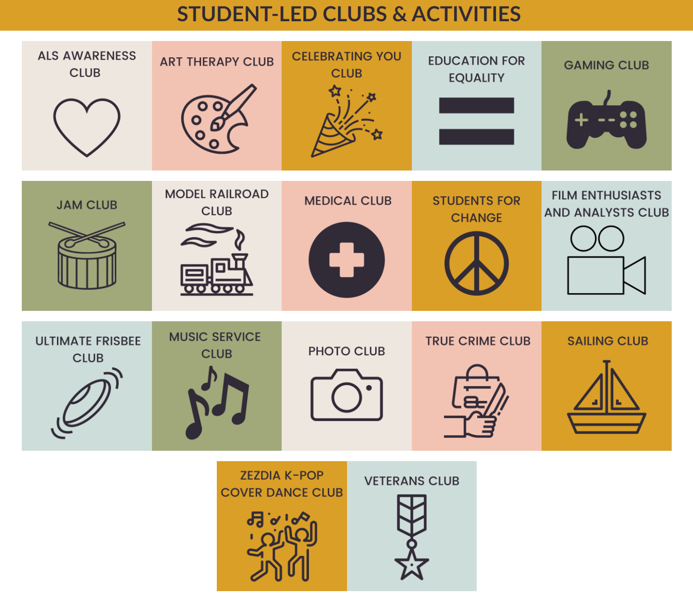

# school-club
**Basic html project demonstrating accessibility principals and responsive design.**
***
Upper Arlington High School believes that a well-rounded education includes participation in extracurricular activities, which is a critical component to becoming Uniquely Accomplished.  We encourage and support students to pursue a variety of extracurricular activities.  This is an excellent way to explore your passions with like-minded individuals.  It also provides opportunities to hone your social, professional, and leadership skills.
 
If your school doesn't have a club that interests you, this is a great opportunity to start your own.  Leadership is about sharing your vision and inspiring others.  It is also about listening and taking feedback.  To that end build a website that shares your vision for a new School Club and takes feedback from potential members.  This site should look good whether viewed from a tablet, a smartphone or a computer monitor.   It should also be accessible to all students.  Below is a list of existing student-led clubs and activities.  Create a new club, something that doesn't exist currently, something you think will be fun or interesting or good for your community!  Here are some [club ideas](https://getschooled.com/article/4082-35-unique-high-school-club-ideas-extracurricular-activities/) to get you started.



***
# Lab Instructions
NOTE: After each code change, refresh the browser to review and test the changes.

## Club Home Page
1. Decide on a new school club to found.
2. Add lang="en" to <html> 
3. Add a unique ```<title>``` that explains the purpose of the page
4. Add your club name to the ```<h1 id="club-name">``` header
5. Add a favicom to the href attribute in the following link in the ```<head>```... ```<link rel="icon" href="">```
6. Add a club quote or mission statement to the ```<blockquote>``` tag
7. Add four thumbnail images to the page with appropriate captions.
8. Using bootsrap align the three images in the ```<div id="image-section">``` section to be horizontal at viewports ≥768px.
9. Add an href attribute to the ```<nav>``` list element ```<li><a>Registration</a></li>``` to redirect to the Registration.html page
10. Run the axe plug-in and fix any issues that have been identified.
11. Turn on the NVDA screen reader and use the arrow down key to navigate through the page.
12. Review the website at three viewports: desktop, laptop, and mobile view.

## Registration Page
13. Open the Registration page.
2. Add lang="en" to <html>
3. Add a unique ```<title>``` that explains the purpose of the page
5. Add a favicom to the href attribute in the following link in the ```<head>```... ```<link rel="icon" href="">```
14. Change the names from q1 and q2 to be more descriptive for the availability questions
 6. Add your club to the option list of the ```<select name="club" id="clubs" required>``` dropdown
15. Add a legend for the availability questions to be supportive for screen reader 
16. Fix the <label>Email:</label> to be accessible (run axe chrome plugin for more info)
17. Fix the `````` (run axe chrome plugin for more info)
18. Run the axe plug-in and fix any issues that have been identified.
19. Turn on the NVDA screen reader and use the arrow down key to navigate through the page.
20. With NVDA still on, use the tab key to navigate to the interactive elements (button, links, form inputs) and make sure they all hold visual focus
21. Review the website at three viewports: desktop, laptop, and mobile view.

 ## Stretch Goals
 - Fix the layout of the main header and footer for small viewports like the Galaxy S8+
 - Make the form more visually appealing using CSS/Bootstrap
 - Create an About Us page or any other additional page you like
 
***

## Helpful Links
 - The full NVDA user guide has all the NVDA commands, split up into different sections for reference. https://www.nvaccess.org/files/nvda/documentation/userGuide.html#RunningNVDA
 - W3Schools is a school for web developers, covering all the aspects of web development. https://www.w3schools.com/html/html_intro.asp
 - Basic grid layouts to get you familiar with building within the Bootstrap grid system. https://getbootstrap.com/docs/4.6/layout/grid/

