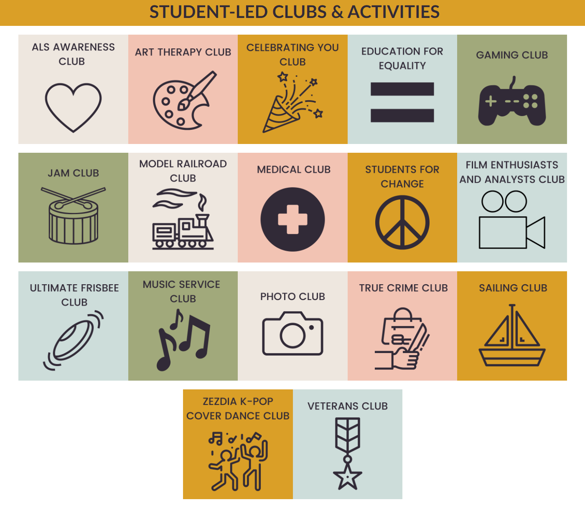

# school-club
**Basic html project demonstrating accessibility principals and responsive design.**
***
Upper Arlington High School believes that a well-rounded education includes participation in extracurricular activities, which is a critical component to becoming Uniquely Accomplished.  We encourage and support students to pursue a variety of extracurricular activities.  This is an excellent way to explore your passions with like-minded individuals.  It also provides opportunities to hone your social, professional, and leadership skills.
 
If your school doesn't have a club that interests you, this is a great opportunity to start your own.  Leadership is about sharing your vision and inspiring others.  It is also about listening and taking feedback.  To that end build a website that shares your vision for a new School Club and takes feedback from potential members.  This site should look good whether viewed from a tablet, a smartphone or a computer monitor.   It should also be accessible to all students.  Below is a list of existing student-led clubs and activities.  Create a new club, something that doesn't exist currently, something you think will be fun or interesting or good for your community!  Here are some [club ideas](https://getschooled.com/article/4082-35-unique-high-school-club-ideas-extracurricular-activities/) to get you started.



***
# Setup
Before starting the lab, get your environment ready. You'll need the project files, a code editor, a screen reader, and the axe DevTools Chrome extension.

## 1. Download the Project
1. On the GitHub repo page, click the green **Code** button.
2. Choose **Download ZIP**.
3. Extract (unzip) the file somewhere easy to find, like your **Desktop** or **Documents** folder.

## 2. Open the Project in VS Code
Pick one of the options below based on whether you can install software on your machine.

### Option A — VS Code Desktop (recommended)
1. Download and install VS Code from [code.visualstudio.com](https://code.visualstudio.com/).
2. Launch VS Code.
3. Click **File → Open Folder…** (top-left menu).
4. Navigate to the extracted project folder and click **Select Folder**.

### Option B — VS Code for the Web (no install needed)
If you can't install software on your machine, you can use the browser version:
1. Open [vscode.dev](https://vscode.dev/) in Chrome or Edge.
2. Click **File → Open Folder…** at the top-left.
3. Select the extracted project folder and grant browser permission when prompted.

> Some advanced features (extensions, terminal) are limited in the web version, but it's fully capable for this lab.

## 3. Set Up a Screen Reader
You'll use a screen reader to complete the accessibility testing steps. Pick the one that matches your operating system:

- **Windows — NVDA** (free download)
  - Download from [nvaccess.org/download](https://www.nvaccess.org/download/).
  - Launch it from the Start Menu. Quit with `Insert + Q`.
- **macOS — VoiceOver** (built-in, nothing to install)
  - Toggle on/off with `Cmd + F5`.
  - Docs: [Apple VoiceOver Guide](https://support.apple.com/guide/voiceover/).
- **Chromebook — ChromeVox** (built-in, nothing to install)
  - Toggle on/off with `Ctrl + Alt + Z`.
  - Docs: [Chromebook screen reader help](https://support.google.com/chromebook/answer/7031755).

## 4. Install axe DevTools (Chrome Extension)
axe DevTools scans your page for accessibility issues.

1. Open Chrome and go to the [axe DevTools listing on the Chrome Web Store](https://chromewebstore.google.com/detail/axe-devtools-web-accessib/lhdoppojpmngadmnindnejefpokejbdd).
2. Click **Add to Chrome**, then **Add extension** in the confirmation dialog.
3. **Important — allow access to local files.** Because we're opening `club.html` and `registration.html` directly from your computer (as `file:///…` URLs), the extension needs permission to scan them:
   - In Chrome, go to `chrome://extensions/`.
   - Find **axe DevTools** in the list and click **Details**.
   - Scroll down and toggle on **Allow access to file URLs**.

### How to Run an axe Scan
1. Open your HTML page in Chrome (e.g., double-click `club.html`).
2. Press `F12` (or right-click → **Inspect**) to open Chrome DevTools.
3. Click the **axe DevTools** tab in the DevTools panel.
4. Click **Scan ALL of my page**.
5. Review each issue — click **Highlight** next to an issue to see it on the page.
6. Fix the issue in your HTML/CSS, save the file, refresh the browser, and re-scan until there are no issues.

***
# Lab Instructions
NOTE: After each code change, refresh the browser to review and test the changes.

> 📘 **Need more detail?** See [`LAB_GUIDE.md`](./LAB_GUIDE.md) for an in-depth walkthrough of every step — including the *why* behind each task, technical concepts, and code hints.

## Club Home Page
1. Decide on a new school club to found.
2. Add lang="en" to ```<html>```
3. Add a unique ```<title>``` that explains the purpose of the page
4. Add your club name to the ```<h1 id="club-name">``` header
5. Add a favicom to the href attribute in the following link in the ```<head>```... ```<link rel="icon" href="">```
6. Add a club quote or mission statement to the ```<blockquote>``` tag
7. Add four thumbnail images to the page with appropriate captions.
8. Using bootsrap align the three images in the ```<div id="image-section">``` section to be horizontal at viewports ≥768px.
9. Add an href attribute to the ```<nav>``` list element ```<li><a>Registration</a></li>``` to redirect to the Registration.html page
10. Run the axe plug-in and fix any issues that have been identified.
11. Turn on the NVDA screen reader and use the arrow down key to navigate through the page.
12. Review the website at three viewports: desktop, laptop, and mobile view.

## Registration Page
13. Open the Registration page.
2. Add lang="en" to <html>
3. Add a unique ```<title>``` that explains the purpose of the page
5. Add a favicom to the href attribute in the following link in the ```<head>```... ```<link rel="icon" href="">```
14. Change the names from q1 and q2 to be more descriptive for the availability questions
 6. Add your club to the option list of the ```<select name="club" id="clubs" required>``` dropdown
15. Add a legend for the availability questions to be supportive for screen reader 
16. Fix the <label>Email:</label> to be accessible (run axe chrome plugin for more info)
17. Fix the `````` (run axe chrome plugin for more info)
18. Run the axe plug-in and fix any issues that have been identified.
19. Turn on the NVDA screen reader and use the arrow down key to navigate through the page.
20. With NVDA still on, use the tab key to navigate to the interactive elements (button, links, form inputs) and make sure they all hold visual focus
21. Review the website at three viewports: desktop, laptop, and mobile view.

 ## Stretch Goals
 - Fix the layout of the main header and footer for small viewports like the Galaxy S8+
 - Make the form more visually appealing using CSS/Bootstrap
 - Create an About Us page or any other additional page you like
 
***
